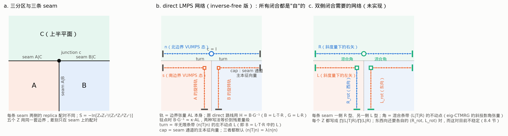
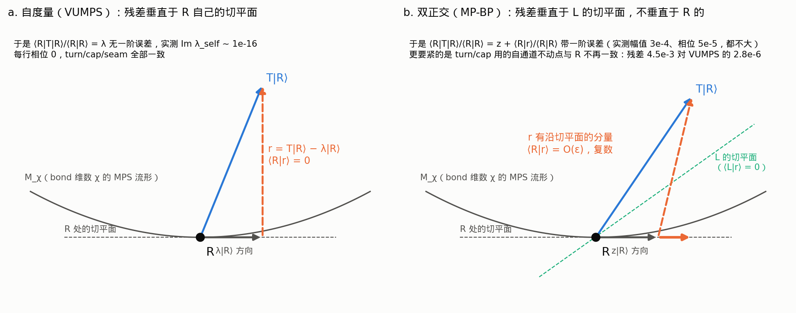
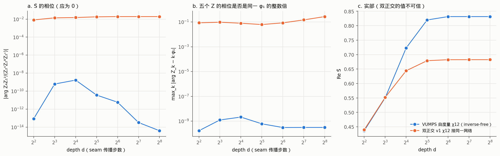
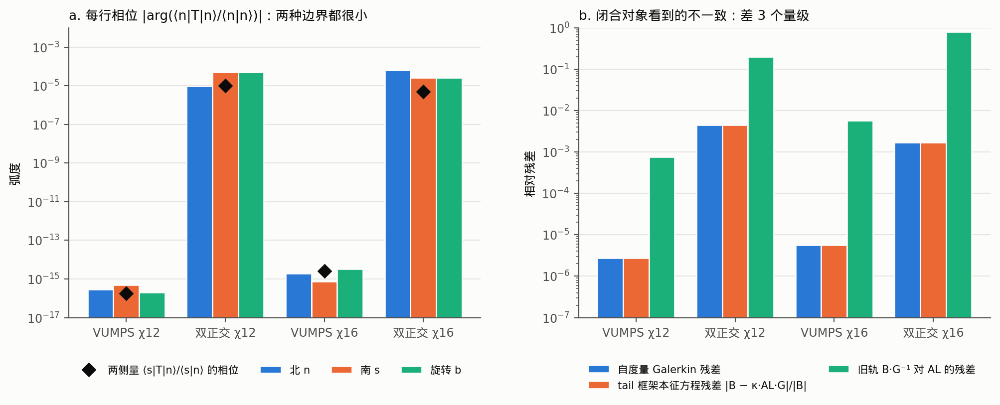

# 为什么双正交的 (L, R) 不能直接接现有 direct LMPS 网络（图解）

> **方法范围更正（2026-09-17）。** 本文所有 S̃ 数值与网络图都建立在 **grown-tail** 路线上（`compressed_direct_rails`：一条边界与它自己的共轭夹一行 T，沿边界方向收缩）。用户要求的默认路线是 **bare/direct**（两列 `G=fp(M_L|M_R)`、三列 `B=fp(M_L|a|M_R)`，沿 seam 方向收缩，实现见 `benchmark/bare_direct_core.jl`，记录见 `data/bare_direct_20260917/README.md` 与 `data/direct_chi_curve/METHOD_STATUS.md`）。因此本文关于 inv(G) 放大、inverse-free、以及“双正交边界接不进 LMPS”的结论只对 grown-tail 网络成立，不能搬到 bare/direct。与路线无关、仍然有效的只有关于边界 MPS 本身的部分：中性 Z2 扇区审计、VUMPS 分支依赖、ξ_phys（它就是 bare 两列通道的关联长度）、两侧估计量 ⟨s|T|n⟩/⟨s|n⟩（它就是 bare 路线的 λ_T/λ_0）。

**2026-09-17 方法纠正：本文的“现有 direct”实为历史 grown-tail / inverse-free
grown-turn 网络，不是用户要求的两列／三列 bare/direct。本文数值和闭合失败
诊断只适用于相应历史构造，不能自动推广到 bare。新 bare χ=4 已通过符号、
相位与长度检查，S̃=0.439613897919；重构一致性与物理精度仍未认证。
定义及新旧/Gaussian benchmark 见[实现 note](fpeps_signs_zh/implementation.md)。**

日期 2026-09-15。数据 `code2d/fpeps/data/biorthogonal_20260915/`（README、jobs.txt），图 `notes/figs_fpeps_biorthogonal_lmps/`，绘图脚本 `code2d/fpeps/benchmark/plot_biorthogonal_lmps_note.py`，每行相位探针 `benchmark/self_channel_phase_probe.jl`（输出 `self_channel_phase_probe.toml`）。本文所有数值都是诊断值，没有一个被接受为正式结果；生产代码与已接受数据未动。前情见 `fpeps_contraction_diagnosis_zh.md` 第 8 节。

## 0. 一句话结论

现有 direct 网络里的每个闭合对象（turn、cap、junction）都是"同一条 MPS 夹住自己"的自通道本征向量。它们彼此一致的前提是边界在**自己的度量**下是驻点。双正交边界是**斜度量**下的驻点，不是自度量驻点：自度量 Galerkin 残差比 VUMPS 态大三个量级（4.5e-3 对 2.8e-6）。于是闭合对象之间不再一致，五个 Z 的相位从 depth=4 起就相差 0.04 到 0.27 弧度，并且不随深度衰减。这**不是**每行相位累积出来的（每行相位只有 5e-5），而是闭合本身错了。

## 1. 网络长什么样（图 1）

- **(a) 几何。** C 是上半平面，A、B 是下半平面的左右两块。三条 seam：A|C 向左、B|C 向右、A|B 向下，交于中心 junction。五个配分函数 Z₁、Z₂ᴬ、Z₂ᴮ、Z₂ᶜ、Z₄ 用**同一套**边界，差别只在 seam 上的 replica 配对。S̃ = −ln[Z₄Z₁²/(Z₂ᴬZ₂ᴮZ₂ᶜ)]，所有和 seam 无关的广延部分要在这个比值里精确相消，剩下的才是 junction。
- **(b) direct 网络（图中画的是 inverse-free 版）。** 北边界 n 沿水平 seam 直接穿过中心（junction c = I）。A、B 各有一条南轨，在中心处经 **turn** 转成向下的旋转轨。每条轨向外传播 depth 步后用 **cap**（seam 通道的主本征向量）收口。
  - 轨的两种写法。原 direct 路线（已接受曲线，`gaussian_boundary_observables.jl` 第 120 行、`direct_graded_sixr_probe.jl` 第 13 行）用 H = B·G⁻¹，其中 B = L·T·R 是 tail 收口的长了一行的轨，G = L·R 是 tail 收口的度量。09-13 起的 inverse-free 版（本文所有数值，包括双正交测试）直接用边界张量 AL（按谱半径归一）当轨，B 和 G 只作诊断。两者在驻点处等价：B·G⁻¹ = κ·AL + O(残差)，这正是 VUMPS 的 AC 方程在 tail 框架里的形式；χ8 两者一致到 1e-12，χ12 为 0.8316 对 0.8333。
  - turn 是半无限条带 ⟨n|T|n⟩ 的左不动点 L，也就是 B = L·T·R 里的那个 L。同一条 MPS 在上、下两侧夹住一行 T，向 −∞ 延伸后收缩成一个角张量。两种写法的 turn 相同。
  - cap 是两条轨夹住 replica 配对的 seam 通道的主本征向量。
  - 代码里对应的自洽检查是 `bg_residual`：把长了一行的轨用 tail 收回来，应当回到轨本身乘度量 G，即 B = (ℓ⊗1)·D·r ≈ κ·AL·G。这个等式成立的条件正是"边界在自度量下是驻点"。
- **(c) 双侧闭合需要的网络（未实现）。** 每条 seam 一侧放 R 型轨、另一侧放 L 型轨；角张量换成混合条带 ⟨L|T|R⟩ 的不动点（论文 eig-CTMRG 的斜投影角张量）；每个 Z 都写成 ∏⟨L|T|R⟩/∏⟨L|R⟩。竖直 seam 还需要旋转框架下各自的 (R_rot, L_rot) 对，而 8.4 节的实验里这一对在所有变体下都不稳定，所以目前连输入都凑不齐。

## 2. 自度量驻点与斜度量驻点的差别（图 2）

把 bond 维数 χ 的 MPS 看成一个流形 M_χ。T|R⟩ 一般跑出流形，截断就是把它拉回来，两种方法的差别在于**用谁的切平面来判定残差 r = T|R⟩ − λ|R⟩ 已经"看不见"**。

- **VUMPS（自度量）**：要求 r 垂直于 R 自己的切平面，P_R r = 0。R 本身在自己的切平面里，所以 ⟨R|r⟩ = 0，⟨R|T|R⟩/⟨R|R⟩ = λ 没有一阶误差。更重要的是，所有由 ⟨n|…|n⟩ 型自通道构造的对象（turn、cap、tail 谱）看到的都是同一个 λ 和同一个不动点。
- **MP-BP（斜度量）**：要求 r 垂直于 L 的切平面，P_L r = 0，即 ⟨L|(T − z)|R⟩ = 0。两侧量 ⟨L|T|R⟩/⟨L|R⟩ = z 精确到 ε²，这是论文的卖点。但 r 在 R 自己的切平面里有 O(ε) 的分量，自通道构造的对象看到的不再是 z 和一个共同的不动点。

实测（表 1）说明一个细节：双正交态的每行自相位其实很小（≤ 6e-5），自本征值的误差甚至比 VUMPS 态还小。**坏的不是"每一行"，而是"收口"**：自度量 Galerkin 残差和 tail 框架本征方程残差都是 4.5e-3，经过病态度量（G 的奇异值比 2.5e-4）后，旧轨 B·G⁻¹ 对 AL 的残差达到 0.2（χ16 达到 0.8）。inverse-free 网络虽然不再显式求逆，但 turn 与 cap 之间的一致性仍由同一个残差控制。

**表 1. 探针数值（`self_channel_phase_probe.toml` 与两个 `entropy.toml`）**

| 量 | VUMPS χ12 | 双正交 χ12 | VUMPS χ16 | 双正交 χ16 |
|---|---|---|---|---|
| 自度量 Galerkin 残差 | 2.8e-6 | 4.1e-3 (n) / 4.5e-3 (s, b) | 5.7e-6 | 1.7e-3 |
| tail 框架本征方程残差 \|B − κ·AL·G\|/\|B\| | 2.8e-6 | 4.5e-3 | 5.7e-6 | 1.7e-3 |
| 旧轨 B·G⁻¹ 对 AL 的残差 | 7.6e-4 | 0.20 | 5.8e-3 | 0.79 |
| 每行自相位 \|arg(⟨n\|T\|n⟩/⟨n\|n⟩)\| | 1e-16 | 9e-6 (n) / 5e-5 (s) | 1e-16 | 6e-5 (n) / 3e-5 (s) |
| 自本征值相对误差 | 6.0e-4 | 2.7e-4 (n) / 3.7e-4 (s) | 5.9e-4 | 9e-5 (n) / 3e-5 (s) |
| 两侧本征值 ⟨s\|T\|n⟩/⟨s\|n⟩ 相对误差 | 3.6e-5 | 5.2e-5 | 1.2e-4 | 5.1e-6 |

## 3. 接进 direct 网络后实际发生了什么（图 3）

把 v1 χ12 的南北对加传输得到的旋转边界，接进 inverse-free direct 测量（`v1_stilde_chi12`），与同 χ 的 VUMPS 态（`inverse_free_20260913/chi12`）逐深度对比：

- **(a) S̃ 的相位。** 应当为 0。VUMPS 态 1e-9 到 1e-14；双正交态 0.008（d=4）升到 0.019（d≥64）后饱和。
- **(b) 五个 Z 的相位是否一致。** VUMPS 态的五个相位精确是同一个 φ₁ 的整数倍（1φ₁, 2φ₁, 2φ₁, 2φ₁, 4φ₁，偏差 3e-10），φ₁ 是 seam 端点常数，在比值里相消。双正交态在 d=256 时的偏差是 Z₂ᴬ −0.042、Z₂ᴮ −0.132、Z₂ᶜ −0.081、Z₄ −0.274，三个本应相等的 Z₂ 彼此都不等。偏差在 d=4 时就已经是 0.09 量级，之后不衰减。
- **(c) 实部。** 双正交态的实部也平滑收敛（0.6824，漂移 1e-4），但由 (a)(b) 可知这个数不可信；同一 ξ_phys（22.5）按 6.1 节的拟合应给 0.75 左右。

从 d=4 起就有 0.1 量级、且不随 d 变化的相位偏差，说明它来自与深度无关的对象，也就是 turn、cap 和 junction 的闭合，而不是每行 5e-5 的累积（后者到 d=256 最多 0.013，与 (a) 的饱和值同量级，但解释不了 (b)）。

## 4. 每行相位与闭合残差（图 4）

- **(a)** turn 所见的每行相位：VUMPS 态 1e-16，双正交态 1e-5 到 6e-5，两侧量的相位也在 1e-5 量级。两种边界的"每一行"都几乎是实的。
- **(b)** 闭合对象看到的不一致：自度量 Galerkin 残差与 tail 框架本征方程残差在两种边界之间差三个量级；旧轨残差把这个差距放大到 O(0.1) 到 O(1)。这就是图 3(b) 里 Z 相位偏差的量级来源。

## 5. 结论与两条出路

1. **原则上可以接，但不是接进现有网络。** 双正交边界要求整套 replica 闭合都是两侧的：每条 seam 一侧 R、一侧 L，角张量取混合条带 ⟨L|T|R⟩ 的不动点，五个 Z 都按 Bethe 形式 ∏⟨L|T|R⟩/∏⟨L|R⟩ 归一。这等于把论文的 eig-CTMRG 做完整，并且要先解决旋转框架 (R_rot, L_rot) 对不稳定的问题。论文本身也说 naive 更新常进入极限环、不动点是鞍点。
2. **便宜的折中：只把双正交态当种子。** 用自度量 VUMPS 抛光几轮后再接现有网络，重新满足自度量驻点条件，可以直接复用 turn/cap/junction。代价是回到自度量分支族，好处只是希望落在 ξ_phys 更大的分支上。这一步还没有跑；如果要跑，放新目录。
